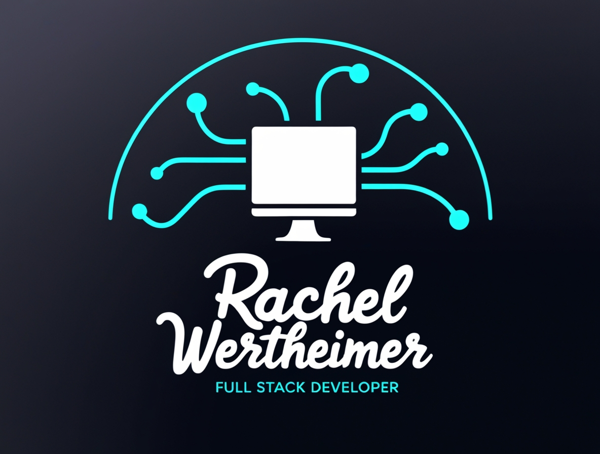

  

---

# 👋 שלום, אני רחל ורטהיימר  
### Full Stack Developer | מפתחת Full Stack

---

## 🧭 קצת עליי  
מפתחת תוכנה עם ניסיון עשיר בפיתוח מערכות Web ופתרונות SaaS, בעלת חשיבה אנליטית, יצירתיות, יוזמה ויכולת למידה עצמית מוכחת.  
בעלת ניסיון ב־**React, Angular, C#, .NET Core, Node.js, PostgreSQL, MySQL, Docker, AWS Lambda** ומחוייבת ליצירת פתרונות חדשניים, יעילים ואיכותיים שמשפיעים על המשתמשים.  
מחפשת תמיד את האתגר הבא שבו אוכל לממש את היכולות שלי ולתרום להצלחת הפרויקטים.

---

## 🛠️ טכנולוגיות וכישורים
### Frontend

### Backend

### Databases

### Tools & Others

---

## 🚀 פרויקטים נבחרים
- 🎧 [MP3 Player App – Java + Spring Boot + Angular](https://github.com/Rachel-wertheimer/boomgefen-job-platform)  
  **תיאור:** אפליקציה לניהול נגן MP3 עם ממשק אינטראקטיבי, API ושמירה מבוססת MVC/JPA  
- 💼 [Job Platform – C# + React + .NET Core](https://github.com/Rachel-wertheimer/support-dashboard)  
  **תיאור:** פלטפורמת ניהול משרות עם אינטגרציה ל־GitHub API, Authentication, Caching וממשק React בענן

---

## 📄 קורות חיים

  
---

## 📊 סטטיסטיקות GitHub

---

### 📫 צרי קשר

---

✨ תודה שביקרתם בפרופיל שלי 👋

